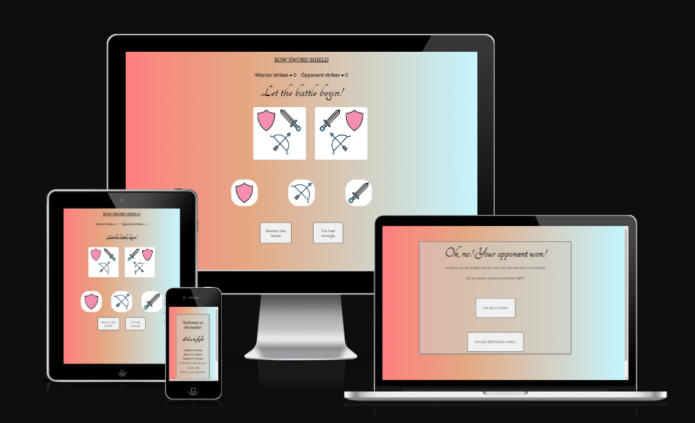

Full responsive site [here](https://ui.dev/amiresponsive?url=https://aurorastorm-sw.github.io/Portfolio-project-2/)

### [Full website here](https://aurorastorm-sw.github.io/Portfolio-project-2/)

# Table of contents

- [UX](#ux)
    - [User goals](#user-goals)
        - [First-time visitor goals](#first-time-visitor-goals)
        - [Returning visitor goals](#returning-visitor-goals)
    - [User stories](#user-stories)
        - [As a website owner](#as-a-website-owner)
        - [As a new user](#as-a-new-user)
        - [As a returning user](#as-a-returning-user)
- [Wireframes](#wireframes)
- [Designs](#designs)
    - [Colors](#colors)
    - [Fonts](#fonts)
    - [Images](#images)
- [Features](#features)
        - [Features left to implement](#features-left-to-implement)
- [Testing](#testing)
    - [Validator testing](#validator-testing)
    - [Manual testing](#manual-testing)
    - [Lighthouse testing](#lighthouse-testing)
    - [Wave testing](#wave-testing)
    - [Bugs](#bugs)
- [Deployment](#deployment)
- [Tools](#tools)
- [Credits](#credits)

# UX

## User goals
- I want it to be clear what type of game it is
- I want to have clear rules layed out as to how to play the game
- I want to easily pick out which are the buttons to play the game
- I want the option to quit or restart the game whenever I like
- I want the game to be interactive and fun

## Returning visitor goals:

## As a website owner:
- I want to continuously update the game and ensure that all features are working as intended.

# Wireframes

All wireframes are made with Balsamiq Wireframes.

Intro screen

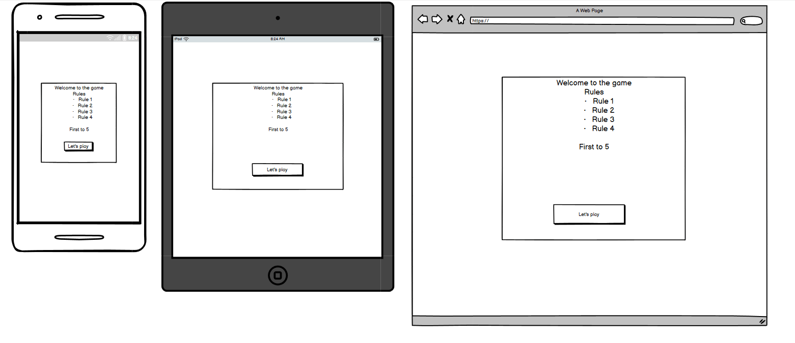

Playfield
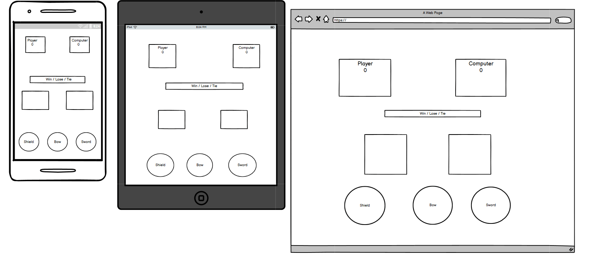

Outro screen
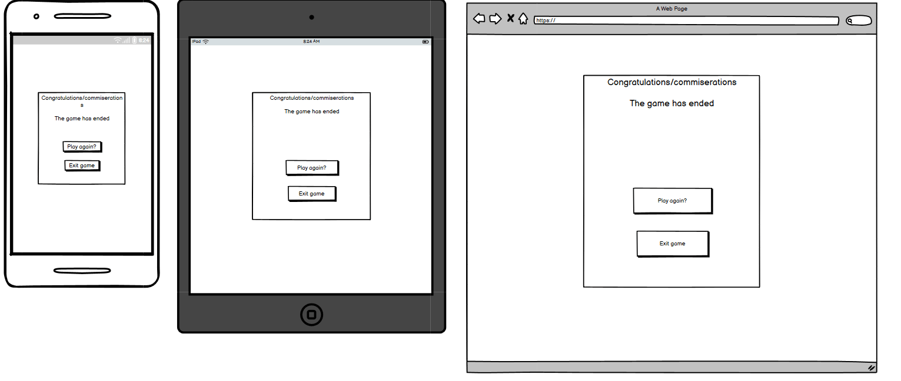

# Designs

## Colors
At first, my palette idea for this project was earthy, woodsy tones with a background of a viking shield, but using an image for a background ended up being too difficult to made fully responsive on all screens. 
I ended up picking a gradient based on the colors of the weapons design that is bright enough for all the text elements to pop, but dull enough that it doesn't take the attention away from the game itself. 

With the help of https://cssgradient.io/, I got a pale, linear gradient with 
- red - #ff0000/rgba(255, 0, 0, 0.5)
- orange/brown - #c85208/rgba(200, 82, 8, 0.5)
- icy blue - #a5f0ff/rgba(165, 240, 255, 0.6)

This color combination doesn't line up with what I first intended, but when adding it as a background I felt pleased that it adds to the more playful vibe. 

## Fonts
When picking fonts for this project, I wanted something that feels 'viking-esque' without making it too cartoonish. The fonts I ended up chosing are; 
- Lora for H1 headings
- Tangerine for H2
- Palanquin for list items and paragraphs

These were all picked out from generating font via https://fontjoy.com/

The fonts were then imported from https://fonts.google.com

## Images

All images are downloaded from https://www.vecteezy.com/members/iyikon.
I chose them to have a toon-ish/fun feel that adds amusement to the "seriousness" of fighting out a battle, also because the images all match in tone.

The image of the combined weapons is made by me by cutting each weapon out and combining in Paint.

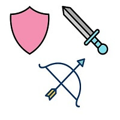

# Features

The website is made up of 3 overlapping sections that are hidden shown as needed throughout the game.

- The first one is an introduction screen that explains the rules of the game, which weapon beats which, and then a button to start a game.

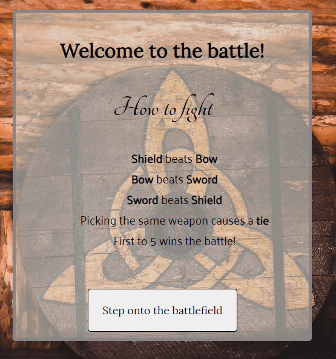

- The second screen is the playfield that is made up of 6 different components

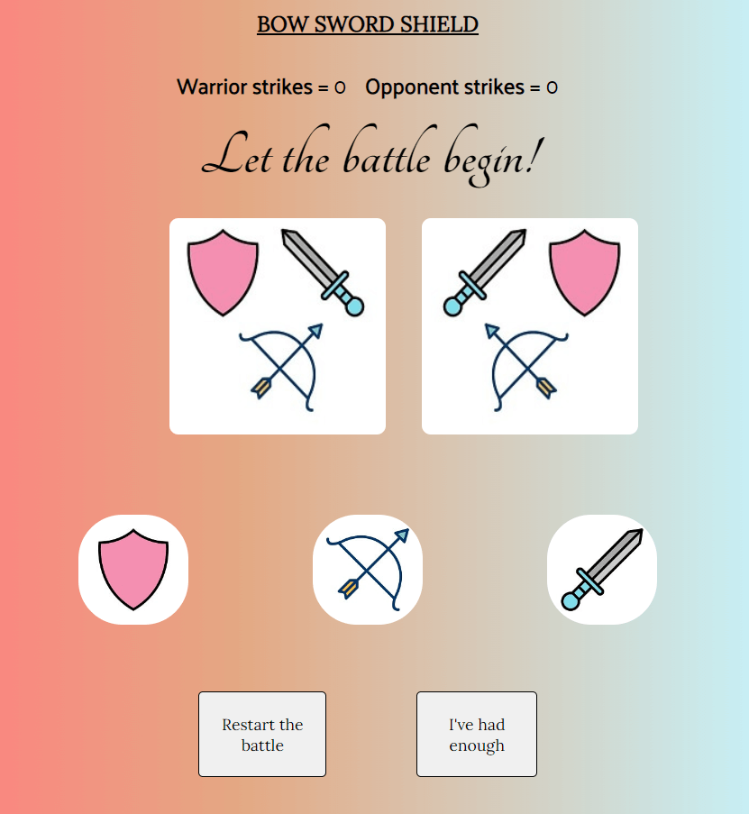

- First up is a banner with the game title that sits ontop of the playfield
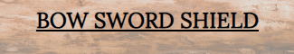

- Below are the scores for the player and the computer that updates after each button click
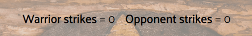

- Below the scores is what I've named the "winner" headline that first urges the player to pick a weapon to start the game, and then will switch to announce if the player or the computer won a score for the round, or if it's a tie.

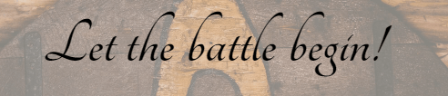
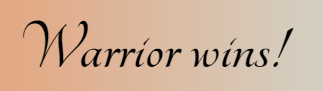
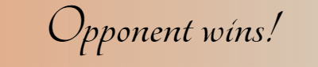
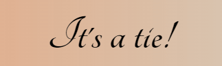

- Then are the hands of the player and opponent, at first showing an image of all weapons to indicate the game hasn't started yet. These images changes thoughout the game depending on what the player and computer picks.

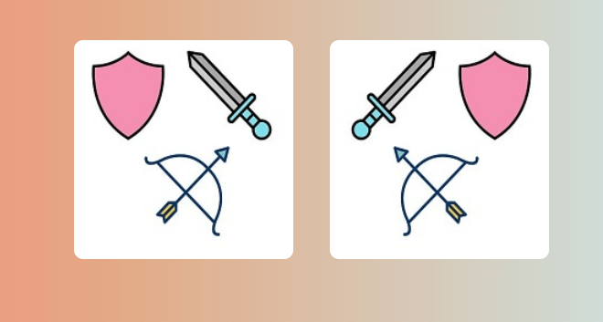

- Below the hands are the play-buttons with available weapons to choose from.

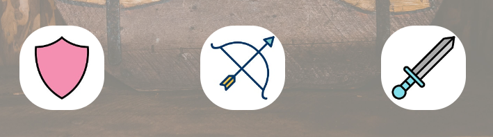

- Below the play-buttons are 2 buttons for the player if they decide to restart the game ("Restart the battle") or quit the game ("I've had enough"). If the battle is restarted, the hands will be holding a sword instead of the collective weapons image.

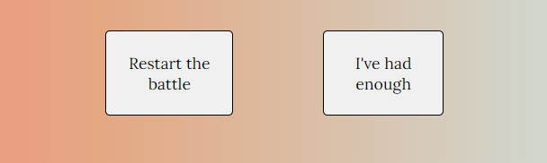
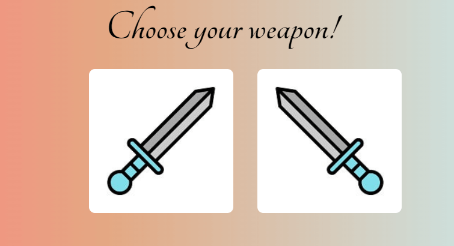

- Then the game is over, an outro screen pops up informing the player of their win or loss, also allowing them to either restart another match ("Let me at them!") or quit the game, which returns the player to the intro screen ("Enough fighting for today").

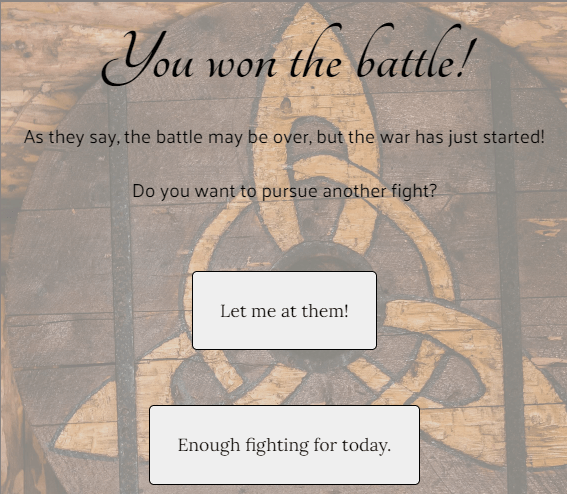
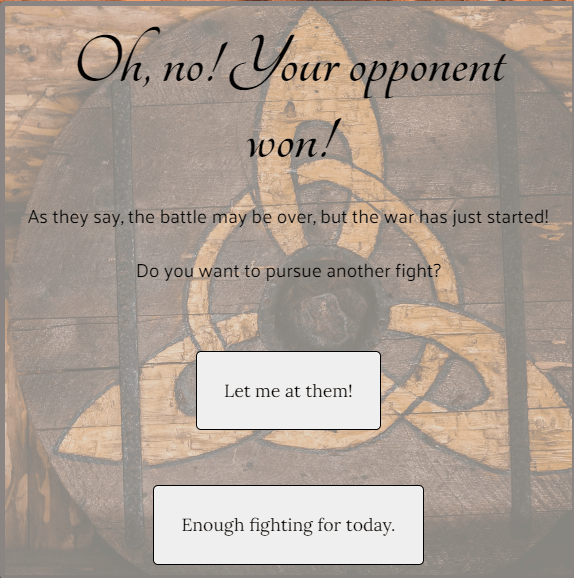

# Features Left To Implement

# Testing

## Validator testing
 [See full HTML validation here]()

 
 [See full CSS validation here]()

[Contrast check]()

## Lighthouse testing

[Full test here]()

## Wave testing

[Full test here]()

## Manual Testing

The website has been manually tested for responsiveness across Firefox, Google Chrome, and Edge on PC and on mobile on Samsung Galaxy S20.

| Action        | Expected Behavior     | Actual Behavior |
|--------------|:-----------:|------------:|
| Load in the page | The intro page shows up and renders fully | Pass  |
| Click start game button | Hide the intro screen and show the playfield | Pass  |
| Click different buttons to play game | Images of clicked buttons show up on screen on click | Pass |
| Lose a game | When opponent reaches 5 points, show the outro screen with 'lost game' message | Pass |
| Win a game | When player reaches 5 points, show the outro screen with 'win game' message | Pass |
| Restart game | The game resets with sword images showing in hand | Pass |
| Quit game | The playfield disappears and the intro screen shows up | Pass

# Bugs

## Fixed bugs

- The computer choice didn't pick images according to console.log, and made me worried that something was wrong with the array.
Solved: Got adviced by a Slack member that the console.log was placed above the initialized function, and the computer was picking out the correct option.

- The score didn't reset when pressing the reset button but only when a new game was started and a move had been made. Asked for help from fellow students and got guided on how to call the correct function at the correct time in the script in order for the score to properly update.

- After adding two additional buttons to the playfield, one for resetting the game and one for quitting, the buttons on the outro screen with the same function stopped working. After a lot of back and forth, got guided by a Slack member on how to properly loop through buttons so they initialize the same function over and over again on different parts of the webpage.

- The logics of the rules didn't apply as planned, turned out I had entered the incorrect order into the 'if else' statement deciding which weapon wins over the other.

## Deployment

This project was deployed via GitHub Pages and the Gitpod browser, used as a development environment. From here I could commit and push my changes throughout the project.

Steps I took to deploy my website;

- Go to the repository for  Portfolio-project-2
- Click the Settings tab and locate the Pages tab
- Select to deploy from main branch
- A few minutes later, upon refreshing the page, my site was live

## Tools
- Windows Paint
- https://balsamiq.com/ - Balsamiq Wireframes
- https://tinypng.com/ - Image compression
- https://ui.dev/amiresponsive - Responsiveness testing
- https://jigsaw.w3.org/css-validator/validator - CSS validation
- https://validator.w3.org/ - HTML validator
- https://contrast-grid.eightshapes.com/ - Contrast checker
- https://developer.chrome.com/docs/devtools/ - Responsiveness testing/bug searching throughout the process
- https://www.w3schools.com/ & https://developer.mozilla.org/en-US/ - Visited several times during the projet to help get codes written correctly.

# Credits

- ReadMe layout taken from my previous project, [Portfolio-Project-1](https://github.com/AuroraStorm-sw/Portfolio-project-1), and adjusted for this project. Inspiration for that was picked from various projects from other Code Institute students from the #peer-code-review forum and https://github.com/kera-cudmore/readme-examples/blob/main/milestone1-readme.md#deployment

- Code institute's template: https://github.com/Code-Institute-Org/gitpod-full-template

- I followed along tutorials from [developedbyed](https://www.youtube.com/watch?v=qWPtKtYEsN4&t=2811s) and [Code with Ania Kubów](https://www.youtube.com/watch?v=RwFeg0cEZvQ&t=764s) on [YouTube](https://www.youtube.com/) to better understand the process of creating a rock, paper, scissors type game and what functions are needed to get it to work.

Background color gradient:
- https://cssgradient.io/

Flavicon:
- Image converted with https://favicon.io/favicon-converter/

Fonts:
https://fonts.google.com

Images:

Shield: https://www.vecteezy.com/vector-art/425257-vector-shield-icon
Bow: https://www.vecteezy.com/vector-art/423523-bow-icon-vector-illustration
Sword: https://www.vecteezy.com/vector-art/420638-weapons-icon-vector-illustration

