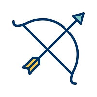

Full responsive site [here](https://ui.dev/amiresponsive?url=https://aurorastorm-sw.github.io/Portfolio-project-2/)

### [Full website here](https://aurorastorm-sw.github.io/Portfolio-project-2/)

# Table of contents

- [UX](#ux)
    - [User goals](#user-goals)
        - [First-time visitor goals](#first-time-visitor-goals)
        - [Returning visitor goals](#returning-visitor-goals)
        - [As a website owner](#as-a-website-owner)
- [Wireframes](#wireframes)
- [Designs](#designs)
    - [Colors](#colors)
    - [Fonts](#fonts)
    - [Images](#images)
- [Features](#features)
    - [Features left to implement](#features-left-to-implement)
- [Testing](#testing)
    - [Validator testing](#validator-testing)
    - [Lighthouse testing](#lighthouse-testing)
    - [Wave testing](#wave-testing)
    - [Manual testing](#manual-testing)
    - [Bugs](#bugs)
- [Deployment](#deployment)
- [Tools](#tools)
- [Credits](#credits)

# UX

## User goals
- I want it to be clear what type of game it is
- I want to have clear rules laid out as to how to play the game
- I want to easily pick out which buttons to click to play the game
- I want the option to quit or restart the game whenever I like
- I want the game to be interactive and fun

## Returning visitor goals:

- I want the game to be consistently functional even if changes are implemented.

## As a website owner:
- I want to continuously update the game and ensure all features work as intended.

# Wireframes

All wireframes are made with Balsamiq Wireframes.

Intro screen

Playfield

Outro screen

# Designs

## Colors
At first, my palette idea for this project was earthy, woodsy tones with a background of a Viking shield, but using an image for a background was too difficult to make fully responsive on all screens. 
Instead, I picked a gradient based on the colors of the weapons design that is bright enough for all the text elements to pop but dull enough that it doesn't take the attention away from the game itself. 

With the help of https://cssgradient.io/, I got a pale, linear gradient with 
- red - /rgba(255, 0, 0, 0.5)
- orange/brown - #c85208/rgba(200, 82, 8, 0.5)
- icy blue - #a5f0ff/rgba(165, 240, 255, 0.6)

This color combination doesn't line up with what I first intended, but when adding it as a background, I felt pleased that it adds to the more playful vibe. 

## Fonts
When picking fonts for this project, I wanted something that feels 'viking-esque' without making it too cartoonish. The fonts I ended up choosing are; 
- Lora for H1 headings
- Tangerine for H2
- Palanquin for list items and paragraphs

These were all picked out from generating font via https://fontjoy.com/

The fonts were then imported from https://fonts.google.com.

## Images

All images are downloaded from https://www.vecteezy.com/members/iyikon.
I chose them to have a toon-ish/fun feel that adds amusement to the "seriousness" of fighting out a battle, also because the images all match in tone.

The image of the combined weapons was made by me by cutting each weapon out and combining them in Paint.

# Features

The website is made up of 3 overlapping sections that are hidden and shown as needed throughout the game.

- The first one is an introduction screen that explains the rules of the game, which weapon beats which, and then a button to start a game.

- The second screen is the playfield, which is made up of 6 different components

- First up is a banner with the game title that sits on top of the playfield

- Below are the scores for the player and the computer that updates after each button click

- Below the scores is what I've named the "winner" headline that first urges the player to pick a weapon to start the game and then will switch to announce if the player or the computer won a score for the round or if it's a tie.

- Then are the hands of the player and opponent, at first showing an image of all weapons to indicate the game hasn't started yet. These images change throughout the game depending on what the player and computer pick.

- Below the hands are the play buttons with available weapons to choose from.

- Below the play buttons are 2 buttons for the player if they decide to restart the game ("Restart the battle") or quit the game ("I've had enough"). If the battle is restarted, the hands will be holding a sword instead of the collective weapons image.

- Then the game is over, an outro screen pops up informing the player of their win or loss, also allowing them to either restart another match ("Let me at them!") or quit the game, which returns the player to the intro screen ("Enough fighting for today").

# Features Left To Implement

- Create logic for a "best out of 3" scenario to make the game more interactive and add to replayability.

# Testing

## Validator testing
 [See full HTML validation here](https://validator.w3.org/nu/?doc=https%3A%2F%2Faurorastorm-sw.github.io%2FPortfolio-project-2%2F)

 
 [See full CSS validation here](https://jigsaw.w3.org/css-validator/validator?uri=https%3A%2F%2Faurorastorm-sw.github.io%2FPortfolio-project-2%2F&profile=css3svg&usermedium=all&warning=1&vextwarning=&lang=en)

[Javascript validation](https://jshint.com/)

[Contrast check](https://color.a11y.com/)

## Lighthouse testing

## Wave testing

[Full WAVE test](https://wave.webaim.org/report#/https://aurorastorm-sw.github.io/Portfolio-project-2/)

## Manual Testing

The website has been manually tested for responsiveness across Firefox, Google Chrome, and Edge on PC and on mobile on Samsung Galaxy S20.

| Action        | Expected Behavior     | Actual Behavior |
|--------------|:-----------:|------------:|
| Load in the page | The intro page shows up and renders fully | Pass  |
| Click start game button | Hide the intro screen and show the playfield | Pass  |
| Click different buttons to play the game | Images of clicked buttons show up on the screen on click and match the set logic between which weapon wins over which| Pass |
| Lose a game | When the opponent reaches 5 points, show the outro screen with 'lost game' message | Pass |
| Win a game | When the player reaches 5 points, show the outro screen with 'win game' message | Pass |
| Restart game | The game resets with sword images showing in hand, scores are reset, and the in-hand images are changed to swords | Pass |
| Quit game | The playfield disappears, and the intro screen shows up | Pass

# Bugs

## Fixed bugs

- The computer choice didn't pick images according to console.log, and it made me worried that something was wrong with the array.
Solved: Got advised by a Slack member that the console.log was placed above the initialized function, and the computer was picking out the correct option.

- The score didn't reset when pressing the reset button but only when a new game was started, and a move had been made. 
Solved: Asked for help from fellow students and got guided on how to call the correct function at the correct time in the script in order for the score to properly update.

- After adding two additional buttons to the playfield, one for resetting the game and one for quitting, the buttons on the outro screen with the same function stopped working. 
Solved: After a lot of back and forth, I got guided by a Slack member on how to properly loop through buttons so they initialize the same function over and over again on different parts of the webpage.

- Following the issue with the two additional buttons, the scoring acted weirdly after resetting the game mid-match and starting a new game. The scores were unevenly added to both player and computer, no matter who won.
Solved: It turns out the event listeners for the game buttons were called twice, once when the game first starts and then again when resetting and starting again. Solved this with help from a Slack member by removing the event listeners in the quitGame() function, so the event listeners are only called once when clicking the button to start the game.

- The logic of the rules didn't apply as planned, and the weapons I planned to win over the others didn't work.
Solved: It turns out I had entered the incorrect order into the 'if else' statement deciding which weapon wins over the other.

## Deployment

This project was deployed via GitHub Pages and the Gitpod browser, used as a development environment. From here, I could commit and push my changes throughout the project.

Steps I took to deploy my website;

- Go to the repository for  Portfolio-project-2
- Click the Settings tab and locate the Pages tab
- Select to deploy from main branch
- A few minutes later, upon refreshing the page, my site was live

For anyone wishing to Fork this repository, then do as follows;

- Log in to GitHub and find your way to the GitHub repository you want, in this case, my [portfolio project 2](https://github.com/AuroraStorm-sw/Portfolio-project-2)
- Up in the right corner of the repository page, on the row of buttons just beneath the user icon, you'll find the "Fork" button.
- Click the "Fork" button, and you will now have created a copy of the repository to your GitHub account.

## Tools
- Windows Paint
- https://balsamiq.com/ - Balsamiq Wireframes
- https://tinypng.com/ - Image compression
- https://ui.dev/amiresponsive - Responsiveness testing
- https://jigsaw.w3.org/css-validator/validator - CSS validation
- https://validator.w3.org/ - HTML validator
- https://jshint.com/ - Javascript validator
- https://color.a11y.com/ - Contrast checker
- https://wave.webaim.org/ - Accessibility evaluation
- https://app.grammarly.com/ - Grammar check
- https://developer.chrome.com/docs/devtools/ - Responsiveness testing/bug searching throughout the process
- https://www.w3schools.com/ & https://developer.mozilla.org/en-US/ - Visited several times during the project to help get codes written correctly.

# Credits

- A lot of my logical issues with JavaScript, I got assistance from fellow Slack member Tony Albanese, who guided me through many of the frustrating bugs that I couldn't handle alone. Without him, this project might not have been done in time, and his assistance has been of immense value.

- README layout taken from my previous project, [Portfolio-Project-1](https://github.com/AuroraStorm-sw/Portfolio-project-1), and adjusted for this project. Inspiration for that was picked from various projects from other Code Institute students from the #peer-code-review forum and https://github.com/kera-cudmore/readme-examples/blob/main/milestone1-readme.md#deployment

- Code institute's template: https://github.com/Code-Institute-Org/gitpod-full-template

- I followed tutorials from [developedbyed](https://www.youtube.com/watch?v=qWPtKtYEsN4&t=2811s) and [Code with Ania Kubów](https://www.youtube.com/watch?v=RwFeg0cEZvQ&t=764s) on [YouTube](https://www.youtube.com/) to better understand the process of creating a rock, paper, scissors type game and what functions are needed to get it to work.

Background color gradient:
- https://cssgradient.io/

Favicon:
- Image converted with https://favicon.io/favicon-converter/

Fonts:
https://fonts.google.com

Images:

Shield: https://www.vecteezy.com/vector-art/425257-vector-shield-icon
Bow: https://www.vecteezy.com/vector-art/423523-bow-icon-vector-illustration
Sword: https://www.vecteezy.com/vector-art/420638-weapons-icon-vector-illustration